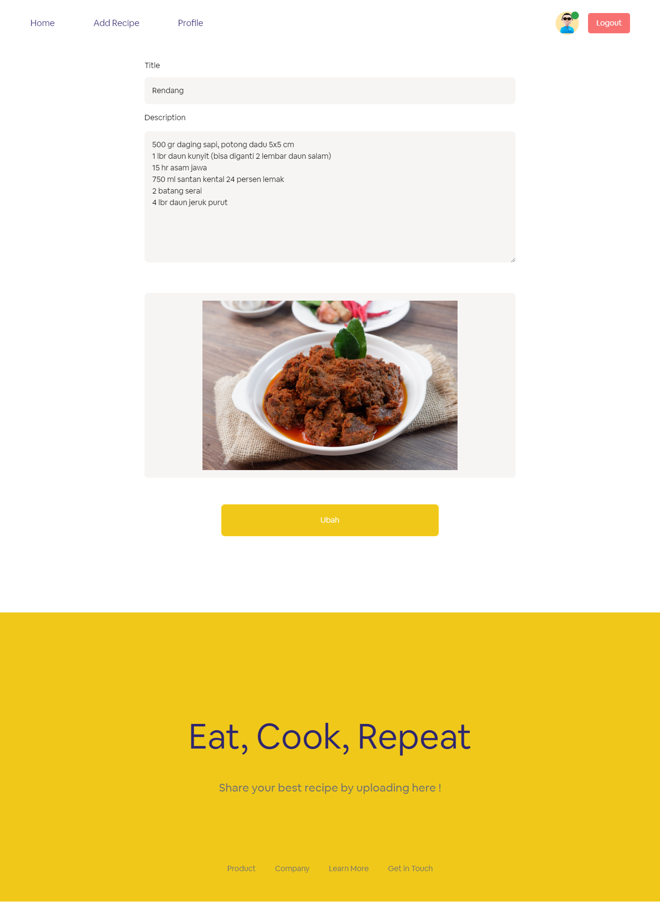

# Mama Recipe

<div align="center">
  
  <br>
  <br>
  <a href="https://wafash-mama-recipe.vercel.app/">View Demo</a>
</div>

## Table of Contents

- [Project Description](#project-description)
- [Technologies Used](#technologies-used)
- [Project Structure](#project-structure)
- [Project Repository](#project-repository)
- [Project Screenshots](#project-screenshots)
- [Getting Started](#getting-started)
- [Contributions](#contributions)
- [License](#license)
- [Contact](#contact)

## Project Description

MamaRecipe is the perfect website for food enthusiasts. With MamaRecipe, you can explore a wide variety of recipes from around the world, as well as create and share your own culinary creations. Discover cooking inspiration, follow easy steps, and enjoy delicious dishes every day. Join the MamaRecipe community and share your cooking expertise with other users.

## Technologies Used

This website is built with following technologies:

- NextJS
- Redux
- Tailwind CSS
- Vercel

By leveraging these technologies, MamaRecipe ensures a robust, scalable, and maintainable web application that delivers a great user experience.

## Project Structure

```
└── recipe-app
      ├── components                         # Contains reusable React components.
      ├── config                             # Contains configuration files.
      ├── constants                          # Contains constant values used throughout the application.
      ├── data                               # Contains data files.
      ├── helpers                            # Contains helper functions and utilities.
      ├── hooks                              # Contains custom React hooks.
      ├── lib                                # Contains library functions and modules.
      ├── pages                              # Contains Next.js pages, which correspond to routes in the application.
      ├── public                             # Contains public assets such as images and fonts.
      ├── screenshots                        # Contains screenshots of the application.
      ├── styles                             # Contains global styles and Tailwind CSS styles.
      ├── .env                               # Contains environment variables.
      ├── .eslintrc.json                     # Configuration file for ESLint.
      ├── .gitignore                         # Specifies files and directories that should be ignored by Git.
      ├── jsconfig.json                      # Configuration file for JavaScript project settings.
      ├── middleware.js                      # Contains middleware functions.
      ├── next.config.mjs                    # Configuration file for Next.js.
      ├── package-lock.json                  # Describes the exact dependency tree generated, ensuring reproducible builds.
      ├── package.json                       # Contains project dependencies and scripts.
      ├── postcss.config.mjs                 # Configuration file for PostCSS.
      ├── README.md                          # The project documentation file.
      ├── tailwind.config.js                 # Configuration file for Tailwind CSS.
```

This structure helps in keeping the project organized and maintainable, making it easier to navigate and manage the codebase.

## Project Repository

This project consists of both frontend and backend repositories. You can find the links to both below:

- Backend Repository: [MamaRecipe Backend](https://github.com/wafash08/mama-recipe-be)
- Live Demo: [MamaRecipe Live Demo](https://wafash-mama-recipe.vercel.app/)

Visit the backend repository for server-side code and API details. The live demo link will take you to the deployed version of the Peworld application.

## Project Screenshots

<table>
  <tr>
    <td>Register</td>
    <td>Login</td>
  </tr>
  <tr>
    <td></td>
    <td></td>
  </tr>
  <tr>
    <td>Home</td>
    <td>Recipe Detail</td>
  </tr>
  <tr>
    <td></td>
    <td></td>
  </tr>
  <tr>
    <td>Add Recipe</td>
    <td>Edit Recipe</td>
  </tr>
  <tr>
    <td></td>
    <td></td>
  </tr>
  <tr>
    <td>Profile</td>
  </tr>
  <tr>
    <td></td>
  </tr>
</table>

## Getting Started

To get a local copy up and running, follow these simple steps.

### Installation

1. Clone the repository

```sh
git clone https://github.com/wafash08/recipe-app
```

2. Navigate to the project directory:

```sh
cd recipe-app
```

3. Install the dependencies:

```sh
npm install
```

4. Start the development server:

```sh
npm run dev
```

This will start the development server and open the application in your default web browser. If it doesn't, you can access it at http://localhost:3000.

### Test User Accounts

Access pre-configured user accounts for testing purposes. Use these accounts to simulate different scenarios.

```json
{
  "email": "carlgustav@gmail.com",
  "password": "asdfhjkl"
}
```

## Contributions

Any contribution to Peworld is welcomed! If you have an idea for a new feature or have found a bug, please follow these steps to contribute:

### How to Contribute

1. Fork the Repository:

Fork the repository to your own GitHub account by clicking the "Fork" button at the top right of the repository page.

2. Clone the Forked Repository:

```sh
git clone https://github.com/your-username/recipe-app.git
```

3. Create a New Branch:

Create a new branch for your feature or bug fix:

```sh
git checkout -b feature/YourFeatureName
```

or

```sh
git checkout -b bugfix/YourBugFixName
```

4. Make Your Changes:

Make the necessary changes in your local development environment.

5. Commit Your Changes:

Commit your changes with a descriptive commit message:

```sh
git add .
git commit -m "Add Your Descriptive Commit Message"
```

6. Push to Your Fork:

Push your changes to your forked repository:

```sh
git push origin feature/YourFeatureName
```

or

```sh
git push origin bugfix/YourBugFixName
```

7. Open a Pull Request:

Open a pull request to the main repository by navigating to the original repository and clicking the "New Pull Request" button. Ensure your pull request includes a clear description of the changes and why they are necessary.

### Issues

If you encounter any issues, please open an issue in the GitHub repository. Provide as much detail as possible to help us resolve the problem quickly.

## License

This project is licensed under the MIT License. For more details, please refer to the [LICENSE](./LICENSE) file.

## Contact

If you have any questions, suggestions, or just want to get in touch, feel free to contact Me!

- Email: saefulhaqwafa@gmail.com
- Linkedin: [linkedin.com/in/m-wafa-saeful-haq](https://www.linkedin.com/in/m-wafa-saeful-haq)
- Twitter: [@saefulhaqwafa](https://x.com/saefulhaqwafa)
